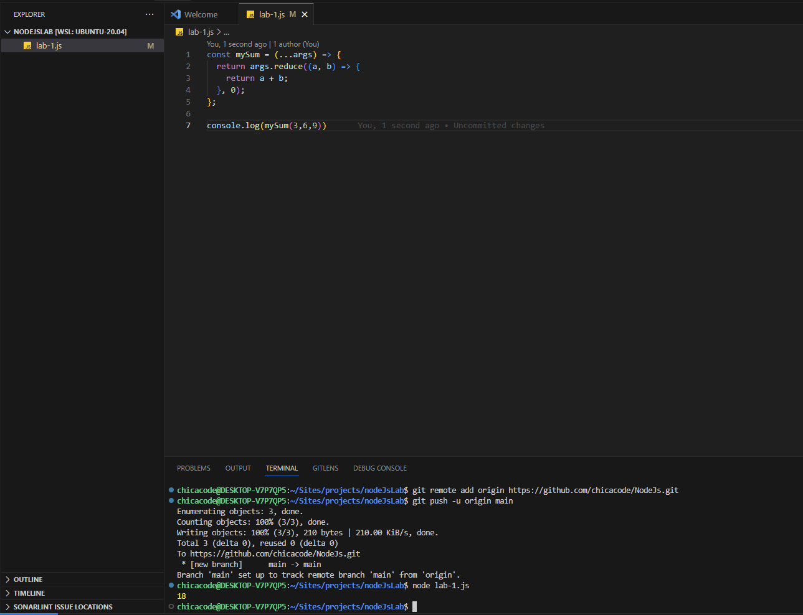

## Objective: 
- In this lab, we will set up a workspace for Node.js development in order to increase our efficiency. Then, we will learn how to use next-gen JavaScript features

## A. Create an arrow function named “mySum”.
- Your function should accept an arbitrary number of arguments using the REST operator.
- Your function should return the sum of all of its inputs. (I am using JS reduce method)

## Node development process

## Developed by 
Geri