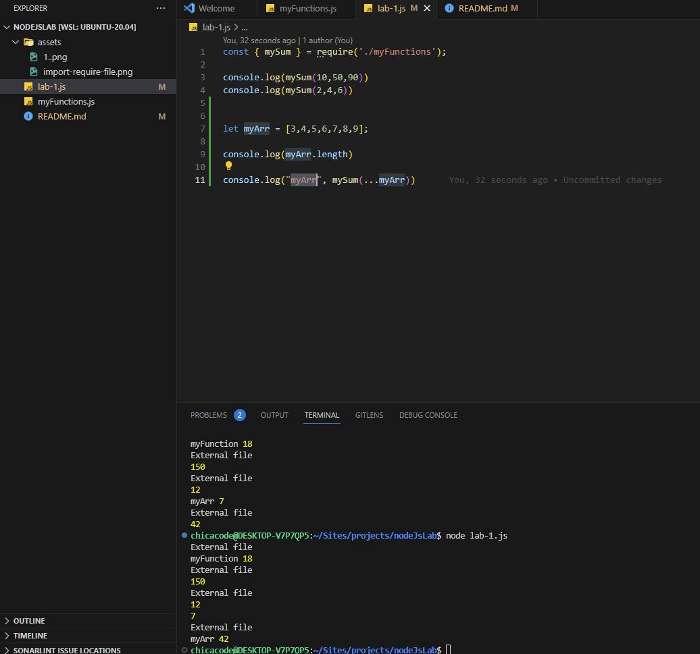
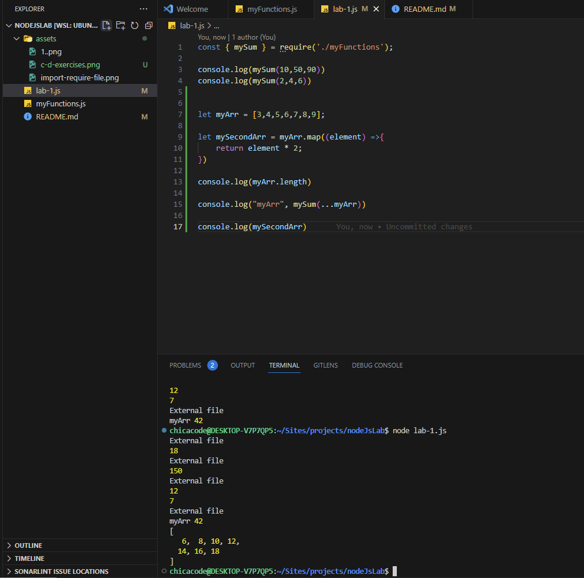
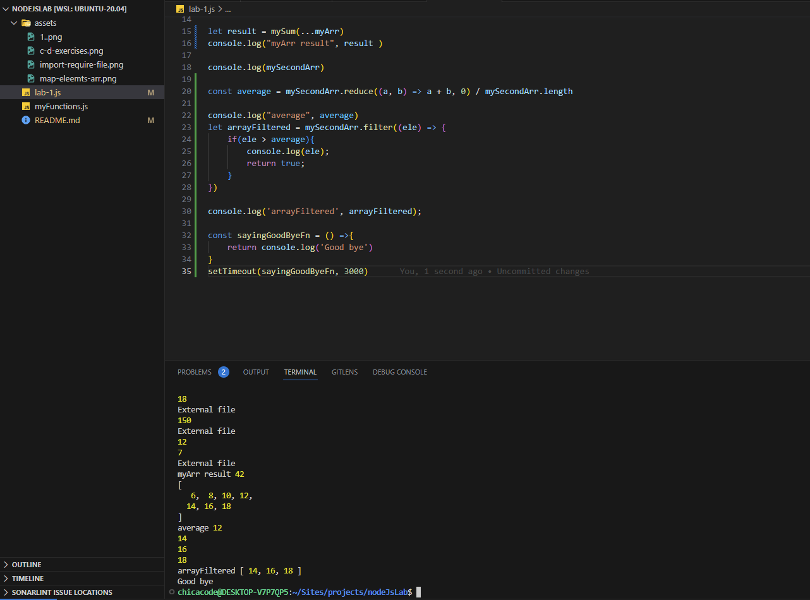

## Objective: 
- In this lab, we will set up a workspace for Node.js development in order to increase our efficiency. Then, we will learn how to use next-gen JavaScript features

## A. 
1. Create an arrow function named “mySum”.
- Your function should accept an arbitrary number of arguments using the REST operator.
- Your function should return the sum of all of its inputs. (I am using JS reduce method)

## B. 
2. Put this function in a different module and export it. Then, in this module, import the module that contains your function and call it from this module
- I've created a module named `lab-1.js` and imported `{mySum}` functions from `myFunction` module

## C. 
3. Create an array of numbers named “myArr”. Your array may have any length (try different lengths to test it). 

## D. 
4. Call your function passing as arguments the members of myArr array using the SPREAD operator. Assign the result to a “result” variable and console log it.

## E. 
5. Create a new array named “mySecondArr”. Map the contents of your myArr array to mySecondArr array using an anonymous function that multiplies each member of myArr by 2.

## F. 
6. Filter the contents of your mySecondArr using an anonymous function that console logs the numbers above average number (you’ll need to find the average first).

## G.  
7. Use setTimeout() function. Pass it a callback function as a parameter that console logs “Goodbye” after 3 seconds.

## H.  
8. Create an “Employee” object that has the following key-value pairs: “name”, “email”, “department” and “startDate”.

## I. 
9. Destructure your object to create a new object, called “Person”, that only has name and email keys (and the corresponding values).
## Node development process

## Features: 
- ES 6 + let, const, spread operator, map, filter, reduce, objects, destructuring, module exports, required and more

## Developed by 
Geri